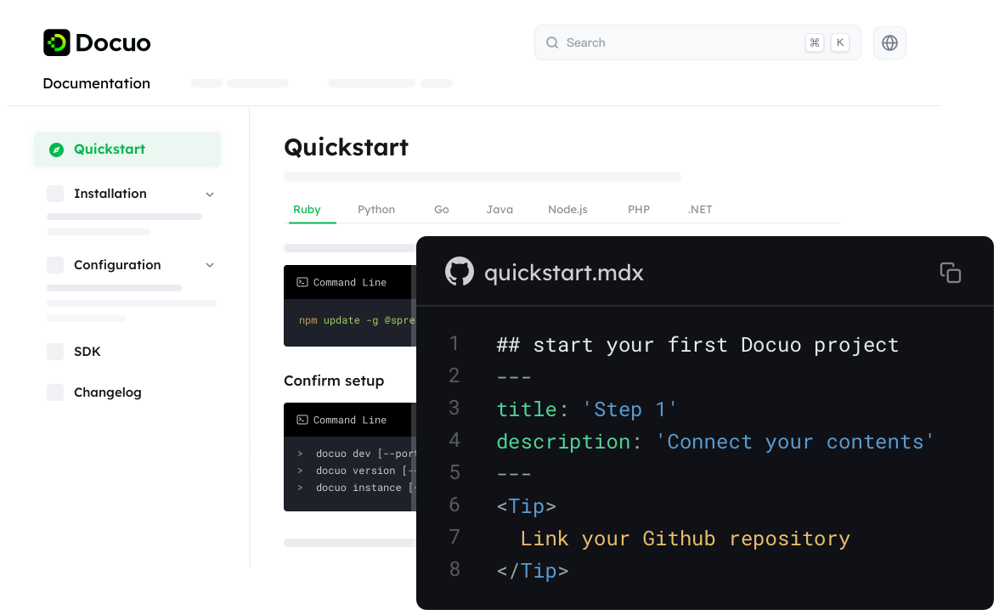
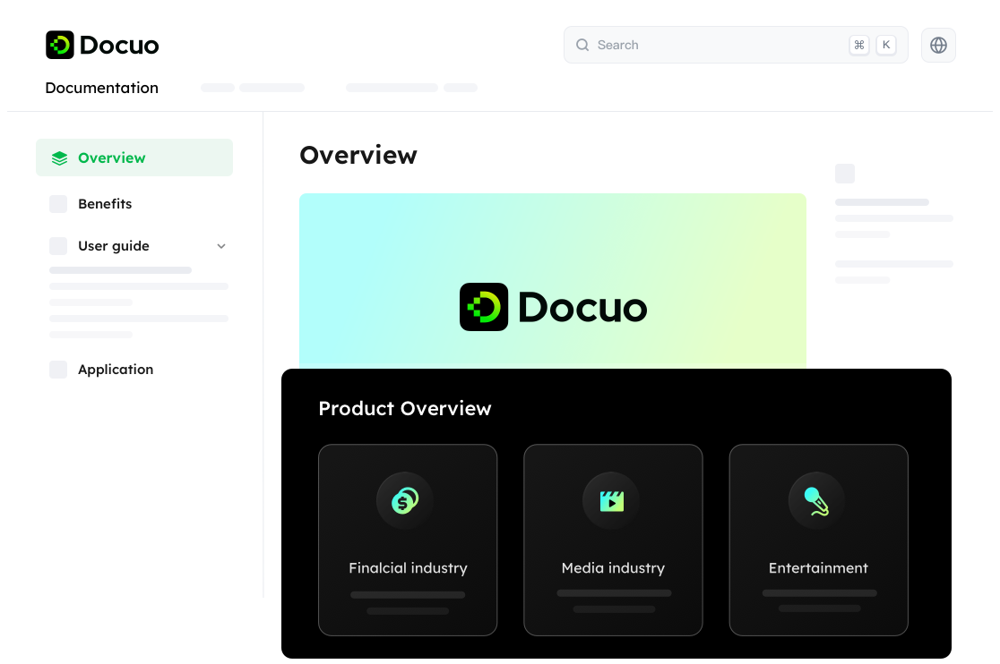

# Introduction123

## Welcome

Welcome to your first documentation homepage.

<CardGroup cols={2}>
  <Card title="First Card" icon="square-1">
    Neque porro quisquam est qui dolorem ipsum quia dolor sit amet
  </Card>
  <Card title="Second Card" icon="square-2">
    Lorem ipsum dolor sit amet, consectetur adipiscing elit
  </Card>
  <Card title="Third Card" icon="square-3">
    Ut enim ad minim veniam, quis nostrud exercitation ullamco
  </Card>
  <Card title="Fourth Card" icon="square-4">
    Excepteur sint occaecat cupidatat non proident
  </Card>
</CardGroup>

Docuo is a lightweight platform that can
<Tip title="Tip">This suggests a helpful tip</Tip>

Docuo is a lightweight platform that can seamlessly convert your static content into dynamic and modern developer hub, API reference, product guides, and other varieties of docs sites.
<Note title="Note">This adds a note in the content</Note>
Docuo is a lightweight platform that can seamlessly conver
<Note title="Note">This adds a note in the content</Note>
Docuo is a lightweight platform that can seamlessly conver

Docuo is a lightweight platform that can seamlessly convert your static content into dynamic and modern developer hub, API reference, product guides, and other varieties of docs sites.

<Frame width="auto" height="auto" >
  
</Frame>

<Tip title="What you can do">You can use Docuo platform to effortlessly transforms your static contents into a modern developer hub, API reference, product guides, and more.</Tip>

## Use cases

Docuo supports helping users to quickly generate different kinds of technical websites, helping companies to engage more end users.

* Developer hub
<Frame width="auto" height="auto" >
  
</Frame>

* API reference
<Frame width="auto" height="auto" >
  
</Frame>

* Product guides
<Frame width="auto" height="auto" >
  
</Frame>